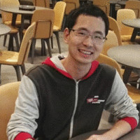

## About Me

I am an algorithm engineer at Key Laboratory of Information Processing of Chinese Academy of Science. Before that, I recieved the B.S. degree and Master degree from BUAA and NUDT respectively. I aslo interned at the SenseTime leaded by [JianPing Shi](http://shijianping.me/) and Multimedia Laboratory in CUHK leaded by [Dahua Lin](http://dahua.me/index.html)

## Research Interest
- Face recognition
- Video semantic segmentation
- Object detection

## Publications
1. Low-Latency Video Semantic Segmentation (Yule Li, Jianping Shi, Dahua Lin, accepted by CVPR
2. Localized Region Context and Object Feature Fusion for People Head Detection (Yule Li, Yong Dou,
Xinwang Liu, Teng Li, published in ICIP 2016)
2018 as spotlight),[pdf](https://arxiv.org/pdf/1804.00389)

